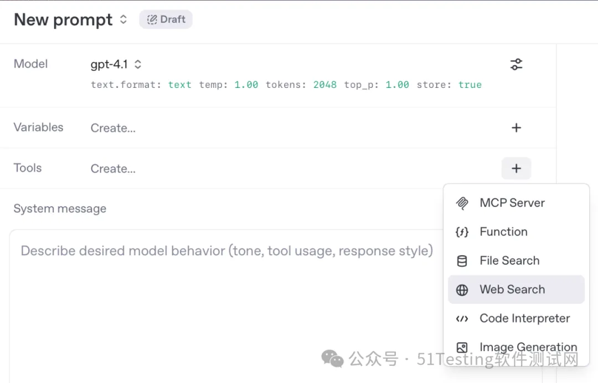
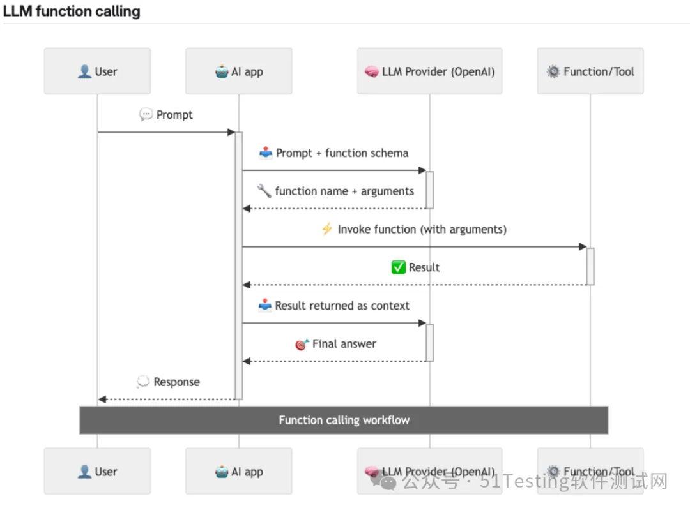
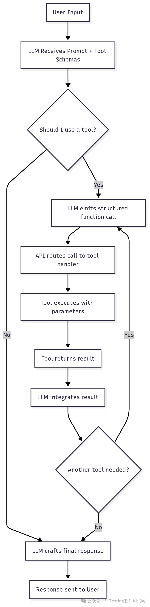
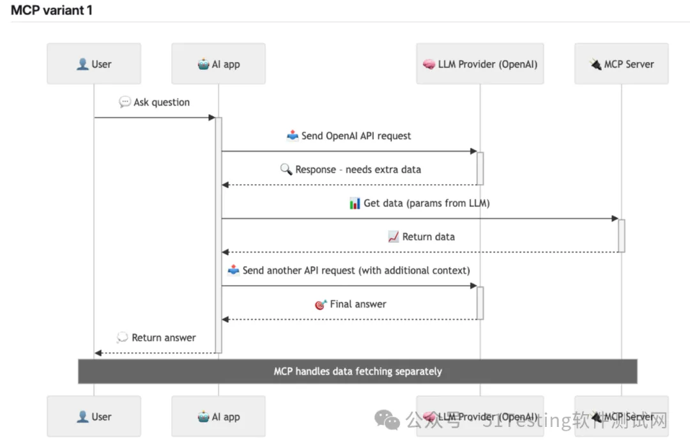
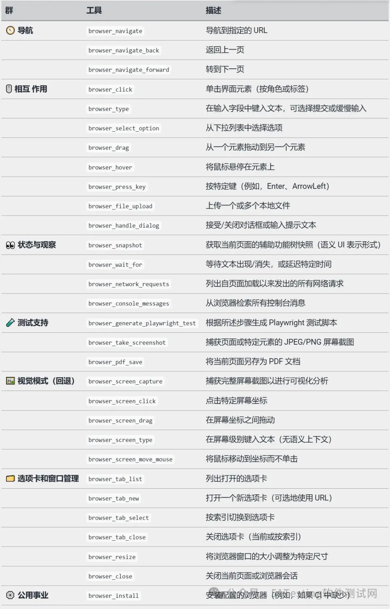
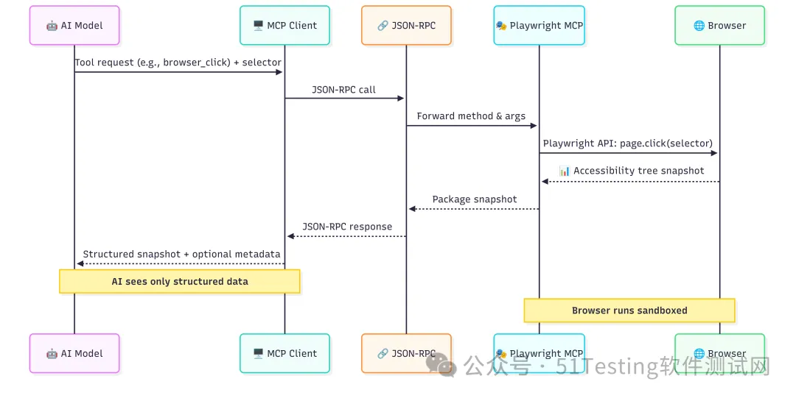

# Playwright MCP是如何工作的？


Playwright MCP是测试自动化领域的最新重大成果。它将最受欢迎的测试工具之一Playwright与新兴的人工智能趋势——模型上下文协议（MCP）连接起来。

  

结果呢？这是一种全新的强大方式，可以将人工智能代理引入软件测试领域。

  

借助Playwright MCP，现代集成开发环境中的AI代理或使用命令行界面（CLI）的代理能够像真实用户一样理解并操作浏览器，生成测试用例，甚至帮助发现漏洞。这是一种全新的思考自动化能做什么的方式。

  

在本文中，我将介绍Playwright MCP是什么、它是如何工作的，以及为什么它可能是测试未来的游戏规则改变者。

  

**理论**

  

在深入技术细节之前，值得退一步，从更宏观的角度来看待这个问题。

  

Playwright MCP开启了强大的新功能，但要真正充分利用它，我们需要理解它为何会这样运作。

  

这不仅仅是一个你可以插入并使用的测试自动化工具。

  

它是建立在现代人工智能概念之上的，比如LLM函数调用和一个名为模型上下文协议（MCP）的新开放标准。

  

因此，在接下来的部分中，我们将奠定基础。我将快速回顾一下当今AI模型如何与工具交互，然后展示MCP如何将其转化为AI代理的通用语言。

  


**LLM函数调用**

  

要理解AI代理如何执行有意义的任务——比如运行命令、搜索文件或与你的系统交互——我们首先需要了解LLM函数调用背后的原理。

  


  

现代语言模型（如GPT-4.1）不仅仅是文本生成器了。

  

它们还可以调用函数（在API定义中为“工具”），但前提是这些函数已被开发者明确定义并暴露出来。在上面的图中，你可以看到OpenAI为GPT-4.1提供的工具。

  

**函数调用工作流程**

  

让我们一步步看看实际发生了什么。

  

  

1\. 用户提示 AI，例如“显示今天修改过的所有文件”。

  

2\. AI应用将该提示传递给LLM提供商（如 OpenAI），同时附上可用工具及其架构的列表。

  

3\. 模型决定需要使用一个工具，并返回一个结构化的函数调用（函数名+参数）。

  

4\. 应用执行该工具并获取结果（例如，文件列表）。

  

5\. 该结果被反馈给模型，模型为用户生成最终答案或调用另一个工具。

  

或者，你可以分析下面的流程图：

  


  

关键要点是：AI并没有自由行动的权力——它只能调用事先注册的工具，使用严格的架构。

  

**工具由AI应用开发者硬编码（并维护）**

  

与你可以动态安装的插件不同，函数调用的工具是由其开发者的开发者硬编码到代理的环境中。

  

每个工具都包含一个架构，定义了AI被允许调用什么、期望什么参数以及如何解释输出。

  

让我们以 Anysphere 开发的AI驱动代码编辑器Cursor为例。

  

Cursor暴露了一个名为 run\_terminal\_cmd 的工具，允许AI建议终端命令——但需要用户批准后才能执行。

  

以下是工具定义（为清晰起见，已摘录）：

  

```json

{
  "name": "run_terminal_cmd",
  "parameters": {
    "required": ["command", "is_background", "require_user_approval"],
    "properties": {
      "command": { "type": "string" },
      "explanation": { "type": "string" },
      "is_background": { "type": "boolean" },
      "require_user_approval": { "type": "boolean" }
    }
  },
  "description": "Propose a command to run on behalf of the user. Requires approval."
}
```

  

当用户输入请求时，代理会确定是否可以使用其工具之一来满足它——如果是，它将返回一个提议的命令，例如：

  

```json

{
  "command": "git status",
  "is_background": false,
  "require_user_approval": true,
  "explanation": "Check for uncommitted changes before running build."
}
```
  

一旦获得批准，命令就会被执行，结果会被路由回LLM，然后LLM会利用这个新上下文来决定下一步做什么——无论是解释输出、建议后续命令还是总结结果。

  

请注意，工具是在客户端执行的，而不是在服务器端。

  


**模型上下文协议（MCP）**

  

现在我们已经了解了LLM函数调用是如何工作的——使用开发者硬编码的预定义工具——接下来的合理问题是：

  

我们如何在不不断修补AI应用本身的情况下扩展这个工具箱？

  

模型上下文协议（MCP）正是为此而设计的。

  

**MCP作为LLM函数调用的扩展**

  

像GPT-4.1这样的LLM并不会自动“知道”如何点击按钮、读取文件或驱动浏览器。它们只能调用在其环境中明确注册的工具。

  

通常，这些工具是直接嵌入到AI应用中的——例如，在Cursor中，工具是由Anysphere的Cursor团队定义和维护的。

  

有了MCP，我们得到了一个更灵活的替代方案。AI应用可以动态连接到外部MCP服务器，这些服务器暴露了整套可调用的工具。

  

这些服务器充当扩展。你不需要修改AI应用本身——你只需将其连接到一个符合MCP规范的服务器，然后应用会通过MCP规范中定义的标准握手来发现可用的工具。

  

**MCP流程**

  

让我们来剖析一下当AI使用MCP服务器提供的工具时真正发生了什么——以Cursor作为MCP客户端示例，Playwright MCP作为连接的服务器。

  


  

1\. 用户通过MCP客户端（例如Cursor或VS Code）连接到MCP服务器。

  

2\. MCP客户端执行握手操作，以发现MCP服务器上可用的工具。

  

例如，Playwright MCP服务器可能会暴露诸如 browser\_navigate 、 browser\_click 和 browser\_snapshot 等工具。

  

3\. 用户输入自然语言提示，例如：

  

“测试我的应用中的登录流程。”

  

4\. AI应用将此提示发送给LLM提供商（例如OpenAI），包括它所拥有的工具定义——无论是内置的还是从连接的MCP服务器发现的。

  

5\. LLM评估该请求，并选择一个可用的工具——例如，它可能会决定使用 browser\_navigate 。

  

6\. LLM将函数调用返回给MCP客户端，指示其调用该特定工具，并附上正确的参数。

  

7\. MCP客户端在MCP服务器上调用所选工具。

  

在这种情况下，Playwright MCP可能会启动浏览器，导航到指定的URL，并返回一个结构化的结果。

  

8\. 结果被返回给LLM，LLM更新其上下文并决定下一步做什么——可能会调用更多工具。

  

9\. 这个循环一直持续，直到LLM产生最终答案，然后将其返回给用户。

  

关键区别在于：我们不需要在AI应用中预先构建每一个可能的工具。MCP通过标准接口动态处理工具访问。这意味着AI可以调用任何符合规范的服务器上托管的工具——而无需AI应用事先了解实现细节。

  

这解锁了强大的灵活性：

  

-   你可以通过连接到新的MCP服务器来扩展AI的能力，而无需修改AI应用本身。
    

  

-   这些服务器可以暴露用于浏览器自动化、文件访问、数据库、Git操作等的工具。
    

  

-   在企业或团队环境中，这种分离关注点是一个巨大的胜利：
    
      
    

-   团队A可以构建和维护MCP服务器（工具逻辑）。
    
-   团队B可以维护AI应用（提示、协调、UI）。
    
-   两者可以独立发展——无需紧密耦合或重新部署循环。
    

  

MCP本质上将工具转变为API式服务，任何AI代理都可以发现并使用它们，从而实现模块化、可扩展且可维护的AI集成系统。

  


**Playwright MCP**

  

Playwright MCP是一个符合MCP规范的服务器，它封装了Microsoft Playwright浏览器自动化框架的能力，并将其作为可调用工具暴露给AI代理。

  

一旦连接，它就为AI提供了对真实浏览器的安全（至少在理论上）、结构化的控制——仅使用高级别的语义指令。

  

在MCP客户端（例如Cursor）中的最简单设置如下所示：

  

```json

{
  "mcpServers": {
    "playwright": {
      "command": "npx",
      "args": [
        "@playwright/mcp@latest"
      ]
    }
  }
}
```

  

**工具**

  

连接后，AI可以访问一系列按功能分组的浏览器自动化工具：

  



请注意，这些工具由Microsoft维护，当你阅读这篇文章时，工具列表可能已经有所不同。

  

**架构**

  

在高级别上，流程如下所示：

  


  

1\. LLM（例如GPT-4.1）决定要执行一个动作，比如点击一个按钮。它将工具请求（例如 browser\_click ）以及参数（如选择器或元素引用）发送给MCP客户端。

  

2\. MCP客户端（例如Cursor）将请求包装起来，并通过JSON-RPC调用将其发送给Playwright MCP服务器。

  

3\. Playwright MCP服务器接收到方法和参数，然后使用Playwright API在真实浏览器实例上执行该动作。

  

4\. 浏览器在沙箱环境中安全地执行该动作。动作完成后，服务器捕获结果状态——通常以辅助功能树快照（语义UI表示）的形式。

  

5\. 快照（结构化数据+可选元数据）被传递回MCP客户端，然后返回给AI模型。

  


**辅助功能树**

  

早些时候，我们看到Playwright MCP不会返回浏览器的原始HTML或截图作为反馈。相反，它给AI提供了一些更有结构、更有意义的东西：辅助功能树快照。

  

但这个想法并不是从AI开始的。

  

**人类的辅助性**

  

辅助功能树最初是为了帮助残疾人与网络互动而创建的。

  

屏幕阅读器、盲文显示器、语音控制系统——它们都依赖于页面内容和交互元素的一致、结构化的表示。原始HTML本身并没有帮助。重要的是：

  

-   我可以点击什么？
    
-   这个按钮的标签是什么？
    
-   这个输入字段是否获得焦点或被禁用？
    
-   页面的结构是什么？
    

  

浏览器将DOM转换为语义抽象——辅助功能树——为辅助技术提供正确的信息，以有意义的方式呈现、说话或导航UI。

  

**什么是辅助功能树？**

  

辅助功能树是当前页面上渲染的UI元素的简化、结构化的抽象。它由浏览器生成，描述了：

  

-   元素的角色（例如，按钮、文本框、标题）
    
-   它们的名称/标签（例如，“提交”、“电子邮件”）
    
-   它们的状态（例如，聚焦、选中、禁用）
    
-   层次结构（例如，按钮在表单内）
    

  

可以将其视为UI的语义骨架——剥离了布局、样式或无关的标记。当您试图理解页面的含义，而不仅仅是它的外观时，这就是重要的。

  

**为什么这对AI来说是理想的？**

  

因为LLM没有空间或像素级的感知能力。它们可以推理的是：

  

-   “有一个标记为‘登录’的按钮”
    
-   “有一个带有占位符‘搜索’的文本框”
    
-   “一个复选框目前是选中的”
    

  

这正是辅助功能树提供的数据类型。

这就是Playwright MCP在执行browser\_snapshot、

browser\_click或browser\_type 等操作后返回给AI的内容。

  

值得一提的是，Playwright正式推荐使用用户界面属性而不是XPath或CSS选择器，如下所示：

  

```python

page.getByRole('button', { name: 'submit' });
```

  

**DOM与辅助功能树——动手实践示例**

  

让我们看看一个简单的HTML表单，看看它是如何转换成辅助功能树的：

  

```html

<form>
  <label for="email">Email</label>
  <input id="email" type="email" required />
  <button>Sign in</button>
</form>
```

  

Playwright代码：

  

```js

const tree = await page.accessibility.snapshot();
console.log(tree);

```

  

样本输出（已简化）：

  

```json

{
  "role": "form",
  "name": "",
  "children": [
    { "role": "textbox", "name": "Email", "required": true },
    { "role": "button", "name": "Sign in" }
  ]
}
```

  

请注意，未标记的 <form> 仍然获得了表单角色，而 <input> 从 <label> 继承了它的名称——这是accname算法的直接结果。

  

**未完待续**，本文我们已经剖析了Playwright MCP的工作原理，下篇我们将为大家继续介绍可以用Playwright MCP做什么，有哪些真实、实用的工作流程，可以改善你的测试。

  


**END**