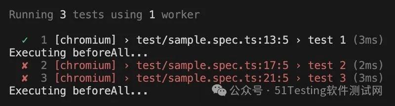
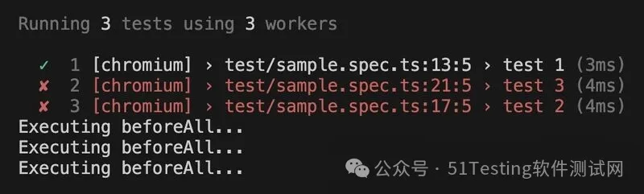
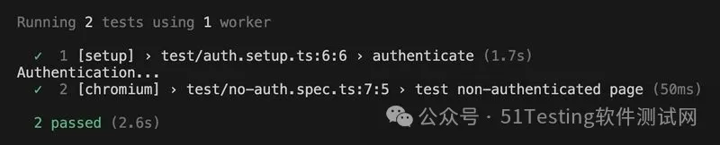
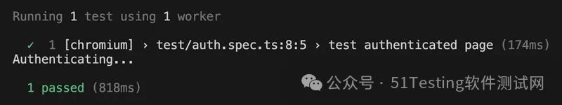

# 全局缓存：让 Playwright 的 BeforeAll 在所有工作线程中只运行一次


  

**引言**

  

我们先来做一个小测验：

  

在以下的 Playwright 代码中，BeforeAll 钩子会运行多少次？

  

```python
import { test, expect } from '@playwright/test';

test.beforeAll(() => {
  console.log('Executing beforeAll...');
});

test('test 1', () => {
  expect(true).toEqual(true);
});

test('test 2', () => {
  expect(true).toEqual(false);
});

test('test 3', () => {
  expect(true).toEqual(false);
});
```

  

答案是：

  

乍一看，它似乎应该在所有测试之前运行一次。  
  

但实际上，它会运行 2、3 或甚至 4+ 次，具体取决于你的 Playwright 配置。

  

-   如果只有一个工作线程，钩子会运行2 次，因为当 test 2  失败时，Playwright 会创建一个新的工作线程并重新运行 BeforeAll 钩子来运行 test 3。
    

  

    
    npx playwright test --workers=1


  


  

-   如果有 3 个工作线程并且是 fullyParallel 模式，钩子会运行 3 次，因为每个测试都在自己的工作线程中运行。
    

  

    
    npx playwright test --workers=3 --fully-parallel

  


  

尽管名字叫 BeforeAll，但它实际上是在每个工作线程中运行一次，而不是在整个测试运行中只运行一次。

  


**“测试设置” 并行化问题**

  

在实际测试之前设置数据是一项非常常见的任务。你可能需要验证用户、填充数据库或准备环境。

  

当测试并行运行时，事情会变得更加复杂，因为有些设置代码应该只运行一次，即使有多个工作线程。

  

Playwright 提供了几种方法，每种方法都有自己的优点和缺点。我们先来看看这些方法，然后我会分享一个结合了每种方法优点的解决方案。

  

**示例**


  

假设有一个网站，既有公开页面，也有需要验证的页面。你需要为它编写 E2E 测试，并创建了两个测试文件：

  

```python

// auth.spec.ts

test('test authenticated page', () => { ... });
```

  

```python

// no-auth.spec.ts

test('test non-authenticated page', () => { ... });
```

  

有 3 种设置验证的方法：

  

1\. 项目依赖

2\. 全局设置

3\. BeforeAll 钩子

  

**1\. 项目依赖**

  

Playwright 文档推荐使用一个单独的setup项目来进行验证。这个项目包含验证代码，而不是测试，并且被设置为主项目的依赖项。

  

```python

// playwright.config.ts

export default defineConfig({
  projects: [
    // Setup project
    { name: 'setup', testMatch: /.*\.setup\.ts/ },
    {
      name: 'chromium',
      use: {
        // Use prepared auth state.
        storageState: 'playwright/.auth/user.json',
      },
      dependencies: ['setup'],
    },
  ]
```

  

✅ 优点：

-   验证只运行一次
    
-   验证步骤在报告中可见
    

  

❌ 缺点：

-   需要一个额外的项目
    
-   即使对于不需要验证的测试，验证也会运行
    

  

为了说明最后一点，我将按照文档中的建议添加重置身份验证代码：

  

```python

// no-auth.spec.ts

// Reset storage state for this file to avoid being authenticated
test.use({ storageState: { cookies: [], origins: [] } });

test('test non-authenticated page', () => { ... });
```
  

并仅运行此文件：

    
    npx playwright test no-auth.spec.ts

  

可以看到项目运行了身份验证流，这是不必要的：

  


  

这绝对是一个需要优化的地方，在这里，仅仅进行身份验证就浪费了2 秒。

  

**2\. 全局设置**

  

Playwright 支持全局设置/清理脚本，作为依赖项目的一个替代方案。

  

但这种方法不被推荐，因为它缺少 Playwright 运行器的许多功能。

  

使用全局脚本的唯一原因是，如果你不想在 Playwright 配置中引入一个额外的项目。

  

✅ 优点：

-   不需要额外的项目
    
-   验证只运行一次
    

  

❌ 缺点：

-   缺少 Playwright 运行器的功能（例如：fixture、跟踪等）
    

-   验证步骤在报告中不可见
    

-   即使不需要，验证也会运行
    

  

**3\. BeforeAll**

  

第三种选择是利用 BeforeAll 钩子来为 auth.spec.ts 执行验证。

  

它只在至少有一个测试运行时才运行：

```python
// auth.spec.ts

test.beforeAll(() => {
  console.log('Authenticating...');
});

test('test authenticated page', () => { ... });

```

  

与项目依赖相比，这是一个更优化的方法。

  

当运行 auth.spec.ts 时，钩子会执行；

    
    npx playwright test "/auth.spec.ts"

  


  

而运行 no-auth.spec.ts 时，钩子不会执行。

    
    npx playwright test "/no-auth.spec.ts"

  


  

但正如前面提到的，这里会遇到所有的问题。每次测试失败时，都会启动一个新的工作线程，触发 BeforeAll 钩子。

  


  

✅ 优点：

-   不需要额外的项目，代码与测试紧密相关
    
-   步骤在报告中可见
    
-   按需运行，只有在需要时才会运行
    

  

❌ 缺点：

-   每个工作线程运行一次，因此在并行模式或失败后会重复运行
    

  


**“全局缓存” 解决方案**

  

我喜欢 BeforeAll 方法，因为它保持了 Playwright 配置的简单性，并且看起来很自然：在所有测试之前运行一些代码。但问题是它会在每个工作线程中重复运行。

  

一年前，我第一次尝试解决这个问题。从那时起，它已经发展成为全局缓存—— 一个辅助模块，确保代码在所有工作线程中只运行一次。

  

这个想法很简单：

  

第一个请求值的工作线程将负责计算它。其他工作线程会等待结果准备好，然后所有工作线程都会得到相同的值。这个值会被缓存并被后续的工作线程重用。

  

以下是其工作原理的图表：

  


  

在 Playwright 测试中集成全局缓存后，它解决了 BeforeAll 钩子的缺点，确保代码只运行一次。

  

API 被包装在一个 globalCache 接口中，提供了方便的方法：

  

    import { globalCache } from '@vitalets/global-cache';

  

实际的验证代码在 BeforeAll 钩子中：

  

    // auth.spec.ts

  

即使任何测试失败或并行运行，验证也只会运行一次。

  


  


**你可能不需要 BeforeAll**

  

最有趣的是，BeforeAll 钩子变得多余了！因为代码保证只运行一次，无论在哪里运行。

  

我可以将验证步骤直接放入 storageState fixture（在每个测试之前运行）。这使得代码更简单：

  

    // auth.spec.ts

  

注意，为了创建一个用于验证的页面，我使用了 browser.newPage() 调用。如果我尝试使用内置的 page fixture，我会得到一个循环依赖错误，因为 page fixture 依赖于 storageState。

  

**多个文件与条件验证**

  

如果有多个验证测试文件，你可以将验证逻辑移到 test.extend() 中以默认应用。特定场景可以通过标签排除：

  

    // fixtures.ts

  

现在，我可以使用这个 test 实例来运行经过验证的测试：

  

    // auth.spec.ts

  

对于未经验证的测试，我只需添加 @no-auth 标签：

  

    // no-auth.spec.ts

  

**总结**

  

全局缓存保持了 BeforeAll 钩子的简单性，但消除了它最大的缺点：在每个工作线程中重复执行。

  

它允许你在所有工作线程中只运行一次任何设置代码，即使在并行模式或分片模式下也是如此。

  

它不仅适用于验证，还适用于数据库填充、昂贵的 API 调用或任何其他共享设置。你可以在项目仓库中找到所有这些示例。