# 我在滴滴探索泛前端代码覆盖率

  

**背景**

  

  

  

通常我们的需求分为提测需求和免测需求，但无论哪种方式，研发自测一直是研发流程中不可或缺的一环。我们团队因研发自测不充分，自2024年起至今，已有3例这样的事故。

  

  

  

**代码覆盖率**

  

  

  

代码覆盖率是指代码的执行情况统计，帮助我们了解那些代码已经被测试覆盖，哪些还没有。它是衡量测试质量的重要手段。

  

通常分为增量覆盖率和全量覆盖率。目前业界比较成熟的方案是使用babel-plugin-istanbul这个工具来进行插桩统计，假如你有以下代码：

```js

function add(a, b) {
  return a + b; // ✅ 语句 + 函数
}
function isEven(num) {
  if (num % 2 === 0) {
    return true; // ✅ 分支（if 的 true 分支）
  } else {
    return false; // ✅ 分支（if 的 false 分支）
  }
}
function max(a, b) {
  return a > b ? a : b; // ✅ 三元表达式也是分支
}
function doNothing() {
  // ✅ 没被调用时，函数覆盖率检测不到
  console.log("I do nothing");
}
console.log(add(1, 2))
console.log(isEven(2))
console.log(isEven(3))
console.log(max(10, 20))
console.log(max(30, 20))
```

  

配置好babel.config.js：

```js
module.exports = {
  plugins: [
    [
      'istanbul',
      {
        // 是否使用内联sourceMap
        useInlineSourceMaps: false,
        // 填入需要获取覆盖率的文件后缀，注意带'.'
        extension: ['.js', '.ts', '.vue'] // jsx,ts,tsx等
      }
    ]
  ]
}
```

  

安装好@babel/cli、babel-plugin-istanbul后执行：

```bash

babel index.js --out-dir dist
```

  

那么编译后会在输出代码里插入覆盖率统计数据：

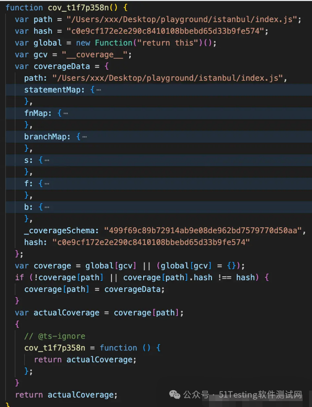

以及插桩代码：

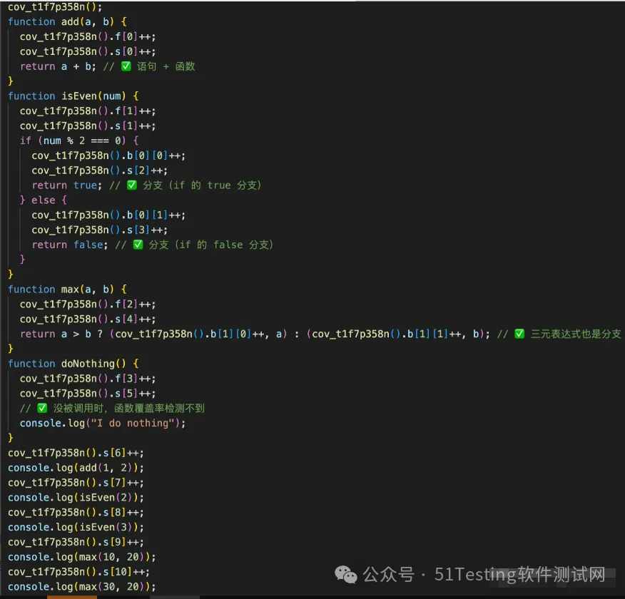
  

其中：

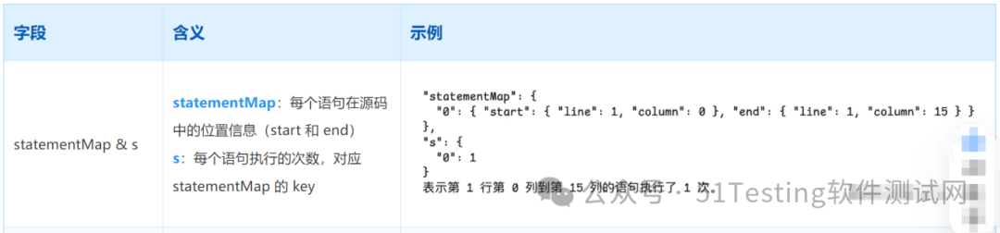

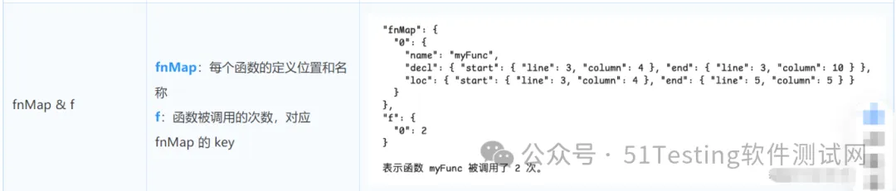

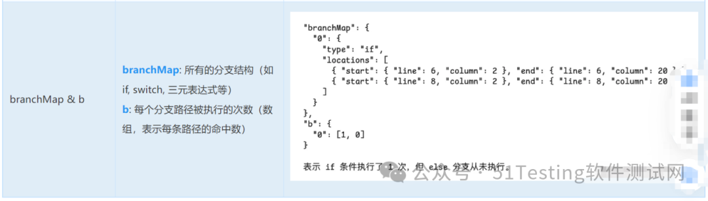
  

  

  

**istanbul插桩**

  

  

  

无论你的项目是基于Webpack构建还是基于Vite、Rollup构建，都能通过配置babel.config.js来实现代码插桩。也就是配置上述babel-plugin-istanbul插件。

  

**已有问题**

  

**代码行列偏移**

以Webpack构建为例，这种插桩方式实际上是基于构建后的代码来插桩的，由于babel处理代码往往是最后一步，因此babel拿到的代码是经过各种loader处理后的**非原始代码**。他的插桩行列号采集的是**编译后的代码的行列号**：

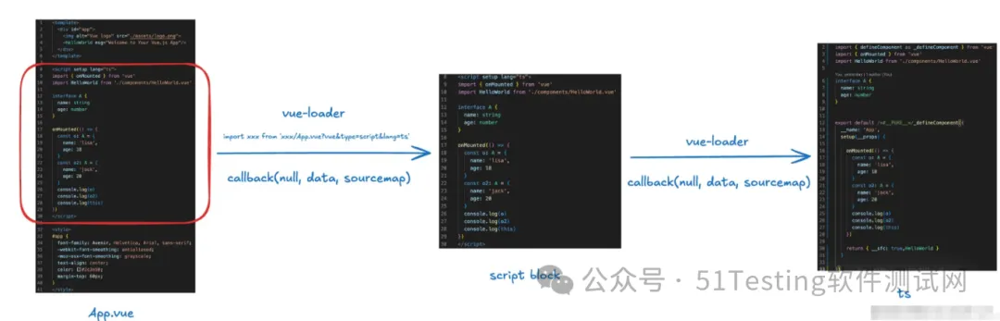

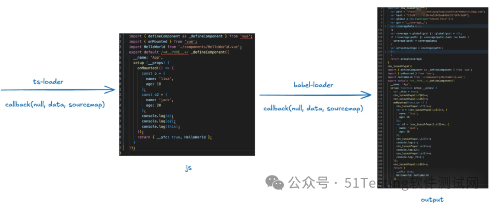

插桩的行列信息是**基于babel-loader拿到的代码**而言的，因为拿到的不是未处理的源码，所以上传的行列号是ts-loader编译后的代码的插桩信息。

因此我们就会看到很多同学说上报的覆盖率数据不正确，行列对应不上。

  

**插桩体积影响**

目前业内主流小程序平台都对小程序的代码包设置了严格的体积限制，**微信是单包 2MB**，**总包 16MB，支付宝是单包 2MB，总包 8MB**；包体积作为有限的资源，在小程序业务开发中异常重要，特别对于像滴滴出行这样的大型复杂业务。——包体积分析

插桩必然伴随着体积的增长，而且增长的体积基本在代码体积的**50%以上**。在小程序的场景里，这种体积增长是完全不可接受的，这会导致小程序无法正常上传、预览。

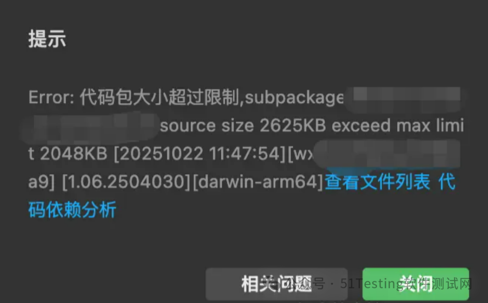

**解决方案**

  

**sourcemap溯源**

对于**行列偏移**而言，正常情况下只要开启项目的sourcemap，比如Webpack中设置devtool: 'source-map'等，那么在打包产物里就能包含各个链路采集的sourcemap。那么通过nyc这个工具就能生成准确的覆盖率报告。

  

以我们的例子为例，在项目根目录配置好.nycrc：

```js

{
  "include": [
    "./**/*.{js,ts,vue}"
  ],
  "excludeAfterRemap": false,
  "exclude": [
    "tests"
  ],
  "extension": [
    ".js",
    ".vue",
    ".mpx",
    ".ts"
  ],
  "report-dir": "./coverage",
  "temp-directory": "./.nyc_output"
}
```

  

安装好nyc：

    
    npm install nyc -D

  

配置好npm script：

```js

{
  "scripts": {
    "report": "nyc report --reporter=html"
  }
}
```

  

在项目根目录生成.nyc\_output文件夹，并把dist/index.js的代码拷贝到浏览器console控制台运行，拿到对应的覆盖率数据coverageData，然后在.nyc\_output目录下生成一个cov.json文件：

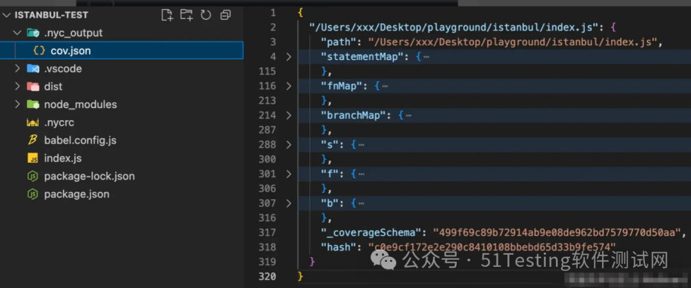


接着执行npm run report就能生成对应的覆盖率数据：

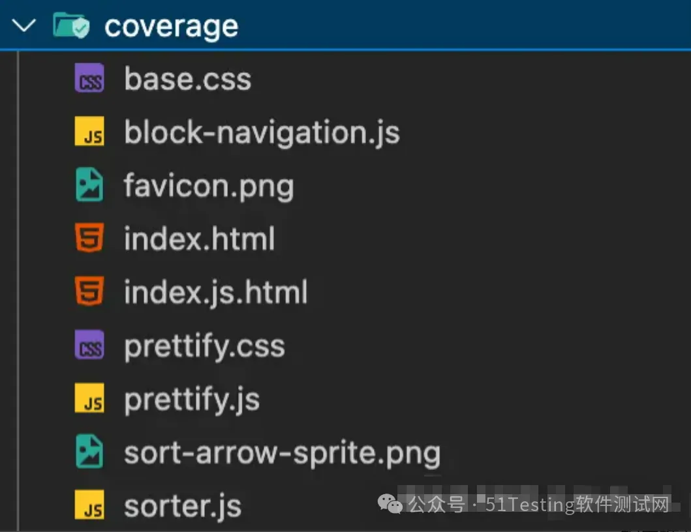


将index.html在浏览器打开就能查看对应的覆盖率报告：

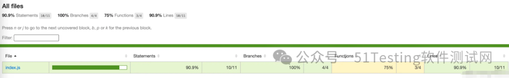

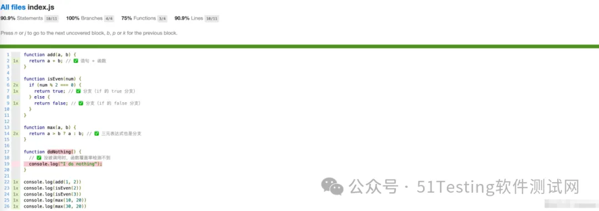


  

但在我们的实际项目中，这种方式存在两个主要问题：

1.  **在整个loader链路的每一环里都有可能丢失sourcemap；**
    
2.  **我们的覆盖率数据往往需要自定义分析，nyc的方式可能并不适合；**
    

不同于rollup，对于webpack loader来说，每一个自定义的loader都需要自己合并来自上游的sourcemap，并且将自己对于代码的转换过程中生成的新的sourcemap，传递给下游。由于loader的开发者着重点不一样，可能有些同学的目的在于完成功能，而忽略了sourcemap的处理，那么sourcempa就会**在这个loader处断裂，导致代码的行列号溯源止步于此。**那么nyc等工具也无法正常展示代码的行列数据信息。

  

未完待续，下篇我们将带领大家继续学习剩余的解决方案及概要设计等内容~