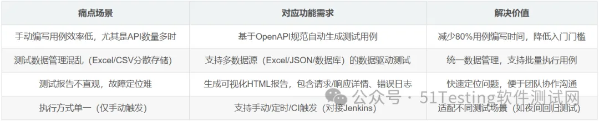
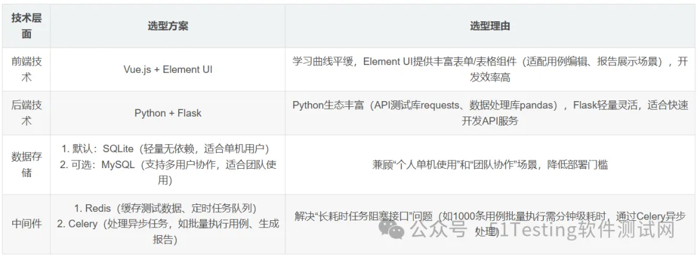

# 智能API测试工具SmartAPITester实现方案详解


  

结合文档中“个人项目实践”章节对SmartAPITester的设计思路，从需求分析、技术选型、核心模块实现、开发流程到部署落地，完整拆解该工具的实现路径，覆盖从代码到产品的全流程。

  

**前期准备：**

**需求分析与技术选型**

  

在编码前需明确工具定位、核心功能及技术栈，确保开发方向匹配用户需求（文档中定位为“降低API测试门槛，提升测试效率”，目标用户为初级测试人员和开发人员）。

  

**1\. 核心需求拆解（从市场痛点出发）**

  


  

**2\. 技术栈选型（兼顾开发效率与扩展性）**

  

文档明确了该工具的前后端、数据存储及中间件选型，确保技术栈轻量且易维护，具体如下：

  



**核心模块技术实现**

**（附关键代码）**

  

SmartAPITester的核心价值在于“智能用例生成”“数据驱动测试”“可视化报告”三大模块，文档提供了关键功能的代码框架，以下结合实际开发场景补充完整实现逻辑。

  

**核心模块1：**

     **基于OpenAPI规范的智能用例生成**

  

该模块是工具的“核心亮点”，通过解析OpenAPI规范（如Swagger文档的JSON/YAML格式），自动生成包含请求参数、断言规则的测试用例，无需用户手动编写。

  

**（1）实现原理**

  

1\. 文档解析：

  

读取OpenAPI文档（支持本地文件上传或远程URL拉取，如http://xxx/swagger.json），

提取paths（API路径）、methods（请求方法）、parameters（参数）、responses（预期响应）等核心信息；

  

2\. 参数示例生成：

  

根据参数类型（string/integer/boolean等）

自动生成合法示例值（如string类型生成“example\_string”，integer类型生成0）；

  

3\. 断言规则默认配置：

  

基于规范中responses的HTTP状态码（如200/400/401），自动添加基础断言（如“响应状态码等于200”“响应体包含data字段”）。

  

**（2）关键代码实现（Python + Flask）**

  

```python

# 1. 解析OpenAPI文档（支持本地文件和远程URL）
import requests
import yaml
import json
from typing import Dict, List

def load_openapi_spec(source: str) -> Dict:
    """加载OpenAPI规范：source为本地文件路径或远程URL"""
    if source.startswith(('http://', 'https://')):
        # 远程URL：通过requests拉取文档
        response = requests.get(source, timeout=10)
        response.raise_for_status()  # 若状态码非200，抛出异常
        if source.endswith(('yaml', 'yml')):
            return yaml.safe_load(response.text)
        else:
            return response.json()
    else:
        # 本地文件：读取JSON/YAML
        with open(source, 'r', encoding='utf-8') as f:
            if source.endswith(('yaml', 'yml')):
                return yaml.safe_load(f)
            else:
                return json.load(f)

# 2. 生成测试用例（核心逻辑）
def generate_test_cases_from_openapi(spec: Dict) -> List[Dict]:
    """从OpenAPI规范生成测试用例列表"""
    test_cases = []
    # 遍历所有API路径（如/api/user、/api/order）
    for path, methods in spec.get('paths', {}).items():
        # 遍历路径下的请求方法（GET/POST/PUT/DELETE）
        for method, details in methods.items():
            # 基础用例结构
            test_case = {
                "case_id": f"{method.upper()}_{path.replace('/', '_')}",  # 唯一用例ID
                "case_name": f"{method.upper()} {path}",  # 用例名称（如GET /api/user）
                "url": path,  # API路径
                "method": method.upper(),  # 请求方法（统一转为大写）
                "description": details.get('summary', '') or details.get('description', ''),  # 用例描述
                "parameters": [],  # 请求参数（query/form/json）
                "assertions": [],  # 断言规则
                "status": "draft"  # 用例状态（草稿/已启用/已禁用）
            }

            # 步骤1：解析请求参数（query参数、body参数等）
            parameters = details.get('parameters', [])  # path/query参数
            request_body = details.get('requestBody', {})  # body参数（JSON/form）
            # 处理path/query参数
            for param in parameters:
                param_info = {
                    "name": param.get('name'),
                    "in": param.get('in'),  # 参数位置：path/query/header/cookie
                    "required": param.get('required', False),
                    "type": param.get('schema', {}).get('type', 'string'),
                    "example": generate_example_value(param.get('schema', {}))  # 自动生成示例值
                }
                test_case['parameters'].append(param_info)
            # 处理body参数（如JSON格式）
            if request_body:
                content = request_body.get('content', {})
                if 'application/json' in content:
                    json_schema = content['application/json'].get('schema', {})
                    test_case['body'] = {
                        "type": "json",
                        "value": generate_json_example(json_schema)  # 生成JSON示例
                    }

            # 步骤2：自动生成基础断言（基于OpenAPI的响应规范）
            responses = details.get('responses', {})
            for status_code, resp_details in responses.items():
                # 优先添加200/201等成功状态码的断言
                if status_code in ['200', '201']:
                    # 断言1：响应状态码等于预期值
                    test_case['assertions'].append({
                        "assert_type": "status_code",
                        "expected": status_code,
                        "operator": "==",  # 比较运算符：==/!=/>/<
                        "description": f"验证响应状态码为{status_code}"
                    })
                    # 断言2：响应体包含核心字段（如data/code/message）
                    if 'application/json' in resp_details.get('content', {}):
                        test_case['assertions'].append({
                            "assert_type": "response_body_contains",
                            "expected": ["data", "code"],  # 默认断言核心字段存在
                            "description": "验证响应体包含核心字段data和code"
                        })
            test_cases.append(test_case)
    return test_cases

# 辅助函数1：根据参数类型生成示例值
def generate_example_value(schema: Dict) -> any:
    """根据JSON Schema生成示例值（如string返回"example_string"）"""
    schema_type = schema.get('type', 'string')
    if schema_type == 'string':
        return "example_string"
    elif schema_type == 'integer':
        return 0
    elif schema_type == 'number':
        return 0.0
    elif schema_type == 'boolean':
        return False
    elif schema_type == 'array':
        # 数组类型：取第一个元素的示例，生成空数组或单元素数组
        items_schema = schema.get('items', {})
        return [generate_example_value(items_schema)] if items_schema else []
    elif schema_type == 'object':
        # 对象类型：递归生成示例
        properties = schema.get('properties', {})
        example_obj = {}
        for prop_name, prop_schema in properties.items():
            example_obj[prop_name] = generate_example_value(prop_schema)
        return example_obj
    return None

# 辅助函数2：生成JSON格式的body示例
def generate_json_example(json_schema: Dict) -> Dict:
    """生成JSON请求体示例（基于OpenAPI的schema）"""
    return generate_example_value(json_schema)  # 复用上述辅助函数
```

  

**（3）功能效果**

  

用户上传Swagger文档

（如http://localhost:8080/v3/api-docs）后，工具可自动生成所有API的测试用例，包含：

  

-   路径：如/api/user/{id}
    
-   请求方法：GET
    
-   参数：id（path参数，类型integer，示例0）、token（header参数，示例"example\_string"）
    
-   断言：状态码==200、响应体包含data/code字段
    

  

**核心模块2：**

     **数据驱动测试执行器**

  

该模块解决“批量测试数据复用”问题，支持从Excel/JSON/MySQL读取测试数据，自动替换用例中的参数值并批量执行，无需手动修改用例。

  

**（1）实现原理**

  

1\. 数据源适配：

  

针对不同数据源（Excel/JSON/MySQL）编写数据读取器，统一输出“测试数据列表”（每条数据对应一次用例执行）；

  

2\. 参数替换：

  

通过“占位符匹配”（如用例中参数值为{{username}}，替换为数据中的username字段值）实现动态参数注入；

  

3\. 异步执行与结果收集：

  

用Celery创建异步任务，批量执行测试用例，实时收集执行结果（成功/失败、响应时间、错误日志）。

  

**（2）关键代码实现**

  

```python

# 1. 数据源读取器（支持Excel/JSON/MySQL）
import pandas as pd
import json
import pymysql
from abc import ABC, abstractmethod

# 抽象基类：定义数据源接口
class DataSource(ABC):
    @abstractmethod
    def read_data(self) -> List[Dict]:
        """读取测试数据，返回列表（每条数据为字典）"""
        pass

# Excel数据源实现
class ExcelDataSource(DataSource):
    def __init__(self, file_path: str, sheet_name: str = 0):
        self.file_path = file_path
        self.sheet_name = sheet_name

    def read_data(self) -> List[Dict]:
        # 使用pandas读取Excel，跳过表头（默认第一行）
        df = pd.read_excel(self.file_path, sheet_name=self.sheet_name)
        # 处理空值（替换为None），转为字典列表
        return df.fillna(None).to_dict('records')

# JSON数据源实现
class JsonDataSource(DataSource):
    def __init__(self, file_path: str):
        self.file_path = file_path

    def read_data(self) -> List[Dict]:
        with open(self.file_path, 'r', encoding='utf-8') as f:
            data = json.load(f)
            return data if isinstance(data, list) else [data]

# MySQL数据源实现
class MysqlDataSource(DataSource):
    def __init__(self, host: str, port: int, user: str, password: str, db: str, sql: str):
        self.host = host
        self.port = port
        self.user = user
        self.password = password
        self.db = db
        self.sql = sql

    def read_data(self) -> List[Dict]:
        # 连接MySQL执行SQL，返回字典列表
        conn = pymysql.connect(
            host=self.host, port=self.port, user=self.user, 
            password=self.password, db=self.db, charset='utf8'
        )
        try:
            with conn.cursor(pymysql.cursors.DictCursor) as cursor:
                cursor.execute(self.sql)
                return cursor.fetchall()
        finally:
            conn.close()

# 2. 数据驱动执行器（核心逻辑）
import requests
from celery import Celery
from datetime import datetime

# 初始化Celery（异步任务队列）
celery_app = Celery(
    'smart_api_tester',
    broker='redis://localhost:6379/0',  # Redis作为消息 broker
    backend='redis://localhost:6379/0'   # Redis存储任务结果
)

class DataDrivenExecutor:
    def __init__(self, test_case: Dict, data_source: DataSource):
        self.test_case = test_case  # 基础测试用例（含占位符）
        self.data_source = data_source  # 数据源
        self.base_url = "http://localhost:8080"  # API基础URL（可配置）

    def execute(self) -> str:
        """启动数据驱动测试，返回Celery任务ID（用于查询结果）"""
        # 读取测试数据
        test_data_list = self.data_source.read_data()
        if not test_data_list:
            raise ValueError("未读取到测试数据")
        # 提交Celery异步任务（批量执行）
        task = batch_execute_task.delay(self.test_case, test_data_list, self.base_url)
        return task.id

# Celery异步任务：批量执行测试用例
@celery_app.task(bind=True, name='batch_execute_task')
def batch_execute_task(self, base_case: Dict, test_data_list: List[Dict], base_url: str) -> List[Dict]:
    """异步执行批量测试，返回每条数据的执行结果"""
    results = []
    total = len(test_data_list)
    # 遍历测试数据，逐个执行用例
    for idx, data in enumerate(test_data_list):
        # 更新任务进度（前端可通过Celery查询进度）
        self.update_state(state='PROGRESS', meta={'current': idx+1, 'total': total})
        # 步骤1：替换用例中的占位符（如{{username}} → data['username']）
        case_with_data = replace_placeholders(base_case, data)
        # 步骤2：执行单条用例
        result = execute_single_case(case_with_data, base_url)
        # 步骤3：记录结果（关联测试数据ID）
        results.append({
            "data_id": data.get('id', idx+1),  # 测试数据唯一标识
            "case_id": base_case['case_id'],
            "execute_time": datetime.now().strftime("%Y-%m-%d %H:%M:%S"),
            "result": result['result'],  # success/failed
            "response_time": result['response_time'],  # 响应时间（毫秒）
            "error_msg": result.get('error_msg', ''),  # 错误信息（失败时非空）
            "request": result['request'],  # 请求详情（便于调试）
            "response": result['response']  # 响应详情
        })
    return results

# 辅助函数1：替换用例中的占位符（如{{param}} → 数据中的param值）
def replace_placeholders(case: Dict, data: Dict) -> Dict:
    """递归替换用例中所有{{key}}格式的占位符，返回新用例"""
    import copy
    case_copy = copy.deepcopy(case)  # 深拷贝避免修改原用例

    # 替换参数中的占位符
    for param in case_copy.get('parameters', []):
        if isinstance(param['example'], str) and '{{' in param['example'] and '}}' in param['example']:
            # 提取占位符key（如{{username}} → username）
            key = param['example'].strip('{{}}').strip()
            if key in data:
                param['example'] = data[key]  # 替换为测试数据中的值

    # 替换body中的占位符（JSON格式）
    if 'body' in case_copy and case_copy['body']['type'] == 'json':
        body_value = case_copy['body']['value']
        case_copy['body']['value'] = replace_json_placeholders(body_value, data)

    return case_copy

# 辅助函数2：替换JSON中的占位符
def replace_json_placeholders(json_obj: any, data: Dict) -> any:
    """递归替换JSON对象中的占位符"""
    if isinstance(json_obj, str):
        if '{{' in json_obj and '}}' in json_obj:
            key = json_obj.strip('{{}}').strip()
            return data.get(key, json_obj)  # 若数据中无该key，保留原占位符
        return json_obj
    elif isinstance(json_obj, list):
        return [replace_json_placeholders(item, data) for item in json_obj]
    elif isinstance(json_obj, dict):
        return {k: replace_json_placeholders(v, data) for k, v in json_obj.items()}
    else:
        return json_obj

# 辅助函数3：执行单条API测试用例
def execute_single_case(case: Dict, base_url: str) -> Dict:
    """执行单条API测试用例，返回执行结果（含请求/响应详情）"""
    import time
    result = {
        "result": "failed",
        "response_time": 0,
        "request": {},
        "response": {},
        "error_msg": ""
    }
    # 构造请求参数
    url = base_url + case['url']
    method = case['method'].upper()
    headers = {param['name']: param['example'] for param in case.get('parameters', []) if param['in'] == 'header'}
    params = {param['name']: param['example'] for param in case.get('parameters', []) if param['in'] == 'query'}
    data = None
    json_body = None
    # 处理body参数（form/json）
    if 'body' in case:
        if case['body']['type'] == 'form':
            data = case['body']['value']
        elif case['body']['type'] == 'json':
            json_body = case['body']['value']

    # 记录请求详情
    result['request'] = {
        "url": url,
        "method": method,
        "headers": headers,
        "params": params,
        "data": data,
        "json": json_body
    }

    try:
        # 发送请求并计时
        start_time = time.time()
        resp = requests.request(
            method=method,
            url=url,
            headers=headers,
            params=params,
            data=data,
            json=json_body,
            timeout=10  # 超时时间10秒
        )
        end_time = time.time()
        response_time = int((end_time - start_time) * 1000)  # 转为毫秒

        # 记录响应详情
        result['response'] = {
            "status_code": resp.status_code,
            "headers": dict(resp.headers),
            "text": resp.text
        }
        result['response_time'] = response_time
        # 执行断言判断结果
        assertions_pass = True
        error_msg_list = []
        for assertion in case.get('assertions', []):
            assert_result, msg = execute_assertion(assertion, resp)
            if not assert_result:
                assertions_pass = False
                error_msg_list.append(msg)

        if assertions_pass:
            result['result'] = "success"
        else:
            result['error_msg'] = "; ".join(error_msg_list)

    except Exception as e:
        result['error_msg'] = f"请求异常：{str(e)}"

    return result

# 辅助函数4：执行单个断言（如状态码断言、响应体包含断言）
def execute_assertion(assertion: Dict, response: requests.Response) -> (bool, str):
    """执行单个断言，返回（断言结果，错误信息）"""
    assert_type = assertion['assert_type']
    expected = assertion['expected']
    operator = assertion.get('operator', '==')
    description = assertion['description']

    if assert_type == 'status_code':
        # 状态码断言
        actual = response.status_code
        expected_int = int(expected)
        if operator == '==':
            pass_flag = (actual == expected_int)
        elif operator == '!=':
            pass_flag = (actual != expected_int)
        else:
            return False, f"不支持的运算符{operator}（状态码断言仅支持==/!=）"
        msg = f"{description}：预期{expected_int}，实际{actual}"
        return pass_flag, msg

    elif assert_type == 'response_body_contains':
        # 响应体包含字段断言（仅JSON响应）
        try:
            resp_json = response.json()
        except Exception:
            return False, f"{description}：响应体不是JSON格式"

        missing_fields = [f for f in expected if f not in resp_json]
        if missing_fields:
            msg = f"{description}：缺少字段{missing_fields}"
            return False, msg
        else:
            msg = f"{description}：所有字段均存在"
            return True, msg

    else:
        return False, f"不支持的断言类型{assert_type}"
```

  

**（3）功能效果**

  

-   用户选择“数据驱动测试”模式，上传Excel测试数据（含username/password/expected\_code字段）；
    
      
    
-   工具自动读取数据，替换用例中{{username}}/{{password}}占位符；
    
      
    
-   异步执行100条用例，前端通过Celery任务ID实时显示进度（如“30/100 执行中”）；
    
      
    
-   执行完成后，生成结果列表，标记成功/失败用例，点击失败用例可查看“请求详情+响应详情+错误日志”。
    

  

**核心模块3**

     **可视化测试报告生成**

  

该模块将执行结果转化为直观的HTML报告，支持导出PDF/Excel，便于团队分享和问题追溯，文档提供了前端组件设计思路，补充后端报告生成逻辑。

  

**（1）实现原理**

  

1\. 报告数据结构定义：

  

整合“用例基本信息+执行结果+统计数据”，形成标准化报告数据；

  

2\. HTML模板渲染：

  

使用Jinja2模板引擎，将报告数据注入HTML模板，生成静态报告文件；

  

3\. 多格式导出：

  

基于HTML报告，使用pdfkit（依赖wkhtmltopdf）转换为PDF，使用pandas导出为Excel。

  

**（2）关键代码实现**

  

```python
# 1. 报告数据组装
def build_report_data(project_name: str, case_results: List[Dict]) -> Dict:
    """组装报告数据（含统计信息、用例结果列表）"""
    # 统计数据
    total = len(case_results)
    success = len([r for r in case_results if r['result'] == 'success'])
    failed = total - success
    pass_rate = (success / total * 100) if total > 0 else 0

    # 耗时统计
    response_times = [r['response_time'] for r in case_results if r['response_time'] > 0]
    avg_response_time = sum(response_times) / len(response_times) if response_times else 0
    max_response_time = max(response_times) if response_times else 0
    min_response_time = min(response_times) if response_times else 0

    # 按用例ID分组（支持多条数据对应同一用例）
    case_groups = {}
    for result in case_results:
        case_id = result['case_id']
        if case_id not in case_groups:
            case_groups[case_id] = {
                "case_id": case_id,
                "case_name": next(c for c in case_results if c['case_id'] == case_id)['case_name'],
                "total": 0,
                "success": 0,
                "failed": 0,
                "results": []
            }
        group = case_groups[case_id]
        group['total'] += 1
        if result['result'] == 'success':
            group['success'] += 1
        else:
            group['failed'] += 1
        group['results'].append(result)

    return {
        "report_id": f"REPORT_{datetime.now().strftime('%Y%m%d%H%M%S')}",
        "project_name": project_name,
        "generate_time": datetime.now().strftime("%Y-%m-%d %H:%M:%S"),
        "statistics": {
            "total_cases": len(case_groups),  # 用例总数（去重）
            "total_executions": total,        # 执行次数（含数据驱动）
            "success": success,
            "failed": failed,
            "pass_rate": f"{pass_rate:.2f}%",
            "avg_response_time": f"{avg_response_time:.0f}ms",
            "max_response_time": f"{max_response_time}ms",
            "min_response_time": f"{min_response_time}ms"
        },
        "case_groups": list(case_groups.values())  # 按用例分组的结果
    }

# 2. 生成HTML报告
from jinja2 import Environment, FileSystemLoader

def generate_html_report(report_data: Dict, output_path: str) -> str:
    """使用Jinja2模板生成HTML报告，返回报告文件路径"""
    # 加载HTML模板（模板需提前编写，放在templates目录）
    env = Environment(loader=FileSystemLoader('templates'))
    template = env.get_template('api_test_report.html')

    # 渲染模板（注入报告数据）
    html_content = template.render(report=report_data)

    # 保存HTML文件
    html_path = f"{output_path}/{report_data['report_id']}.html"
    with open(html_path, 'w', encoding='utf-8') as f:
        f.write(html_content)

    return html_path

# 3. 导出PDF报告（依赖pdfkit和wkhtmltopdf）
import pdfkit

def export_pdf_report(html_path: str, output_path: str) -> str:
    """将HTML报告转为PDF，返回PDF文件路径"""
    # 配置wkhtmltopdf路径（需本地安装，Windows/Linux路径不同）
    config = pdfkit.configuration(wkhtmltopdf=r'C:\Program Files\wkhtmltopdf\bin\wkhtmltopdf.exe')
    # PDF生成选项（设置页面大小、边距）
    options = {
        'page-size': 'A4',
        'margin-top': '15mm',
        'margin-right': '15mm',
        'margin-bottom': '15mm',
        'margin-left': '15mm',
        'encoding': 'UTF-8',
        'no-outline': None
    }

    # 生成PDF
    pdf_path = html_path.replace('.html', '.pdf')
    pdfkit.from_file(html_path, pdf_path, configuration=config, options=options)
    return pdf_path

# 4. 导出Excel报告
def export_excel_report(report_data: Dict, output_path: str) -> str:
    """将报告结果导出为Excel，返回Excel文件路径"""
    # 整理执行结果为DataFrame
    execution_data = []
    for case_group in report_data['case_groups']:
        for result in case_group['results']:
            execution_data.append({
                "报告ID": report_data['report_id'],
                "项目名称": report_data['project_name'],
                "用例ID": result['case_id'],
                "用例名称": case_group['case_name'],
                "测试数据ID": result['data_id'],
                "执行时间": result['execute_time'],
                "执行结果": result['result'],
                "响应时间(ms)": result['response_time'],
                "错误信息": result['error_msg'],
                "请求URL": result['request']['url'],
                "请求方法": result['request']['method']
            })

    # 生成Excel（使用pandas的ExcelWriter，支持多sheet）
    excel_path = f"{output_path}/{report_data['report_id']}.xlsx"
    with pd.ExcelWriter(excel_path, engine='openpyxl') as writer:
        # Sheet1：执行结果详情
        pd.DataFrame(execution_data).to_excel(writer, sheet_name='执行详情', index=False)
        # Sheet2：统计汇总
        stats_data = [
            ["项目名称", report_data['project_name']],
            ["报告生成时间", report_data['generate_time']],
            ["用例总数", report_data['statistics']['total_cases']],
            ["执行总次数", report_data['statistics']['total_executions']],
            ["成功次数", report_data['statistics']['success']],
            ["失败次数", report_data['statistics']['failed']],
            ["通过率", report_data['statistics']['pass_rate']],
            ["平均响应时间", report_data['statistics']['avg_response_time']],
            ["最长响应时间", report_data['statistics']['max_response_time']],
            ["最短响应时间", report_data['statistics']['min_response_time']]
        ]
        pd.DataFrame(stats_data, columns=['统计项', '数值']).to_excel(writer, sheet_name='统计汇总', index=False)

    return excel_path
```

  

**（3）HTML模板核心片段（示例）**

  

在templates/api\_test\_report.html中编写报告模板，核心片段如下：

  

```html

<!DOCTYPE html>
<html>
<head>
   <meta charset="UTF-8">
   <title>{{ report.project_name }} - API测试报告</title>
   <style>
       /* 基础样式：表格、按钮、统计卡片等 */
       .stats-container { display: flex; gap: 20px; margin: 20px 0; }
       .stats-card { padding: 15px; border-radius: 8px; background: #f5f5f5; flex: 1; text-align: center; }
       .stats-card .value { font-size: 24px; font-weight: bold; margin: 10px 0; }
       .success { color: #4CAF50; }
       .failed { color: #f44336; }
       table { width: 100%; border-collapse: collapse; margin: 10px 0; }
       th, td { border: 1px solid #ddd; padding: 8px; text-align: left; }
       th { background: #f2f2f2; }
   </style>
</head>
<body>
   <div>
       <!-- 报告标题与基础信息 -->
       <h1>{{ report.project_name }} API测试报告</h1>
       <p>报告ID：{{ report.report_id }}</p>
       <p>生成时间：{{ report.generate_time }}</p>

       <!-- 统计卡片 -->
       <div>
           <div>
               <div>用例总数</div>
               <div>{{ report.statistics.total_cases }}</div>
           </div>
           <div>
               <div>执行总次数</div>
               <div>{{ report.statistics.total_executions }}</div>
           </div>
           <div class="stats-card success">
               <div>成功次数</div>
               <div>{{ report.statistics.success }}</div>
           </div>
           <div class="stats-card failed">
               <div>失败次数</div>
               <div>{{ report.statistics.failed }}</div>
           </div>
           <div>
               <div>通过率</div>
               <div>{{ report.statistics.pass_rate }}</div>
           </div>
       </div>

       <!-- 用例执行详情（按用例分组） -->
       
       <div>
           <h2>用例：{{ case_group.case_name }}（ID：{{ case_group.case_id }}）</h2>
           <p>执行统计：总{{ case_group.total }}次，成功{{ case_group.success }}次，失败{{ case_group.failed }}次</p>

           <!-- 该用例的所有执行结果 -->
           <table>
               <thead>
                   <tr>
                       <th>测试数据ID</th>
                       <th>执行时间</th>
                       <th>执行结果</th>
                       <th>响应时间(ms)</th>
                       <th>操作</th>
                   </tr>
               </thead>
               <tbody>
                   
                   <tr>
                       <td>{{ result.data_id }}</td>
                       <td>{{ result.execute_time }}</td>
                       <td class="successfailed">
                           {{ result.result }}
                       </td>
                       <td>{{ result.response_time }}</td>
                       <td>
                           <!-- 查看详情按钮（点击展开请求/响应） -->
                           <button onclick="toggleDetail('detail-{{ loop.index }}')">查看详情</button>
                       </td>
                   </tr>
                   <!-- 详情面板（默认隐藏） -->
                   <tr id="detail-{{ loop.index }}" style="display: none;">
                       <td colspan="5">
                           <div>
                               <h4>请求详情</h4>
                               <pre>{{ result.request | tojson(indent=2) }}</pre>
                               <h4>响应详情</h4>
                               <pre>{{ result.response | tojson(indent=2) }}</pre>
                               
                               <h4>错误信息</h4>
                               <pre>{{ result.error_msg }}</pre>
                               
                           </div>
                       </td>
                   </tr>
                   
               </tbody>
           </table>
       </div>
       
   </div>
   <script>

       // 切换详情面板显示/隐藏
       function toggleDetail(id) {
           const elem = document.getElementById(id);
           elem.style.display = elem.style.display === 'none' ? 'table-row' : 'none';
       }
   </script>
</body>
</html>
```

  

**（4）功能效果**

  

-   报告包含“统计汇总”（通过率、响应时间分布）和“用例详情”（每条执行结果的请求/响应）；
    
      
    
-   支持点击“查看详情”展开完整的请求头、参数、响应体，便于故障定位；
    
      
    
-   提供“导出PDF”“导出Excel”按钮，满足不同场景的分享需求（如邮件发送PDF、数据分析用Excel）。
    

  

未完待续，下篇我们将继续为大家讲解前端界面实现、部署与产品化落地及总结等内容~