Python中常用的6种数据类型：

布尔类型的定义：

比较运算符：

总结：

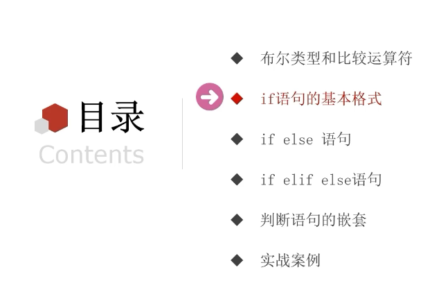

### list嵌套列表的下标索引：

### list列表的常用方法：

### 查找list列表中某元素的下标：

### 修改list列表特定位置的元素值：

### list列表的插入：

### list列表的追加：

### list列表的删除、清空、统计某元素在列表中的数量：

### 统计列表内有多少元素

### 列表方法总结：

### 列表的特点：

### list列表常用功能练习：

#### list列表的遍历：

#### while循环遍历列表：

#### for循环遍历list列表：

#### 对比：

#### 案例

### 元组

#### 定义元组

#### 元组的相关操作：

####  总结

#### 案例：

### 字符串

#### 字符串的下标索引

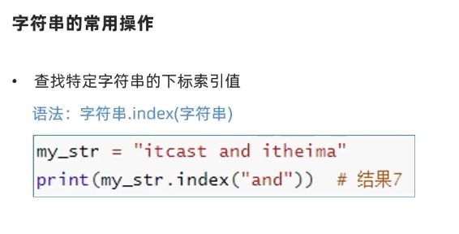

#### 字符串的替换

#### 字符串的分割

#### 字符串的规整操作

#### 字符串的遍历：while、for

#### 字符串的特点：

#### 案例：

### 序列

#### 序列的常用操作：

#### 总结

#### 案例

### set集合

#### 集合的定义

#### 集合的修改-添加元素

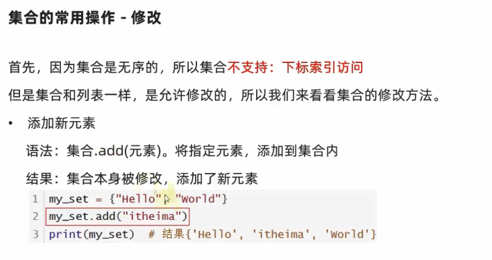

#### 集合的修改-移除元素

#### 集合的修改-随机取出一个元素

#### 集合的修改-清空集合

#### 集合的修改-取两个集合的差集

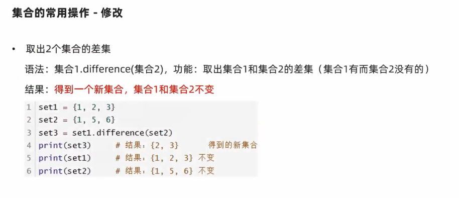

#### 集合的修改-消除差集

#### 集合的修改-合并集合

#### 总结

#### 集合的特点：

#### 案例

### 字典

#### 字典的定义

#### 字典数据的获取

#### 字典的嵌套

#### 总结

#### 字典的常用操作

#### 字典常用操作的总结

#### 案例

### 数据容器对比

#### 数据容器的通用操作

#### 字符串大小比较

#### ASCII码表

### Python函数进阶

#### 函数多返回值

#### 函数多种传参

##### 位置参数

##### 关键字参数

##### 缺省参数

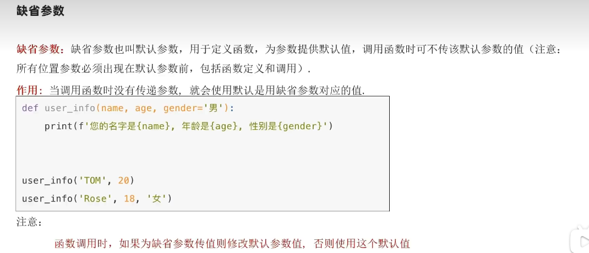

##### 不定长参数

##### 总结

#### 函数作为参数传递

#### 匿名函数

### Python文件操作

#### 文件编码

#### 文件操作

##### 打开文件

##### 文件读操作的相关方法

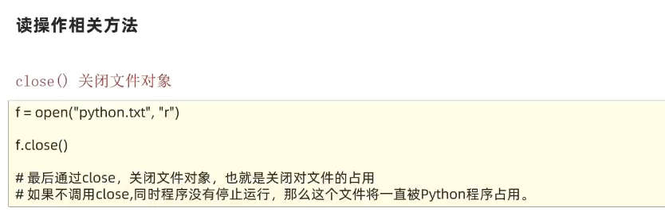

##### 案例

##### 文件写操作

##### 文件追加操作

##### 案例

### 异常

##### 异常的捕获

##### 捕获指定的异常

##### 捕获多个异常

##### 异常else

##### 异常的finally

#### 异常的传递

### Python模块

##### 什么是模块

##### 模块的导入方式

##### import模块名

##### 总结

##### 自定义模块

##### 测试模块

#### Python包

##### 导入包

##### 第三方包

##### 综合案例

### Python基础综合案例

#### json数据格式

#### pyecharts模块

##### pyecharts入门

##### pyecharts配置

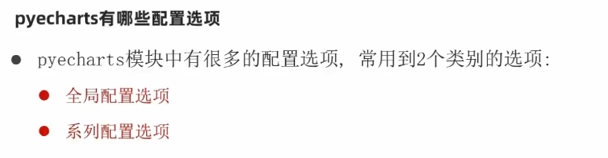

##### 地图使用

##### 动态柱状图

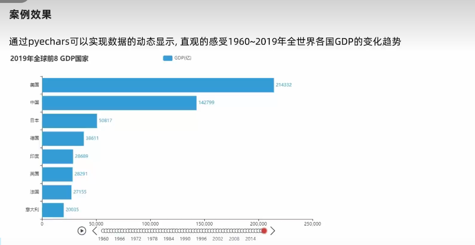

##### 时间线

##### 时间线自动播放

##### 时间线设置主题

##### 列表排序方法

##### 需求

### 对象

### 类

##### 类的定义和使用

##### 成员变量和成员方法

##### 成员方法的定义

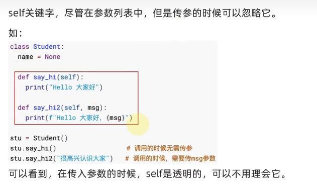

##### 总结

#### 类和对象

##### 构造方法

##### 案例

#### 内置方法

##### 魔术方法

##### 字符串方法

##### 小于符号比较方法

##### 小于等于比较符号方法

##### 比较运算符

##### 总结

#### 封装

##### 面相对象的三大特性

##### 封装

##### 私有成员&&私有方法

##### 总结

##### 案例

#### 继承

##### 单继承

##### 多继承

##### 总结

#### 复写和使用父类成员

##### 调用父类同名成员

##### 总结

#### 类型注解

##### 变量的类型注解

##### 类型注解的介绍

##### 类型注解的语法

##### 类型注解的限制

##### 类型注解总结

#### 函数（方法）形参、返回值的注解

##### 形参的注解

##### 返回值的注解

#### Union类型

##### 变量

##### 函数

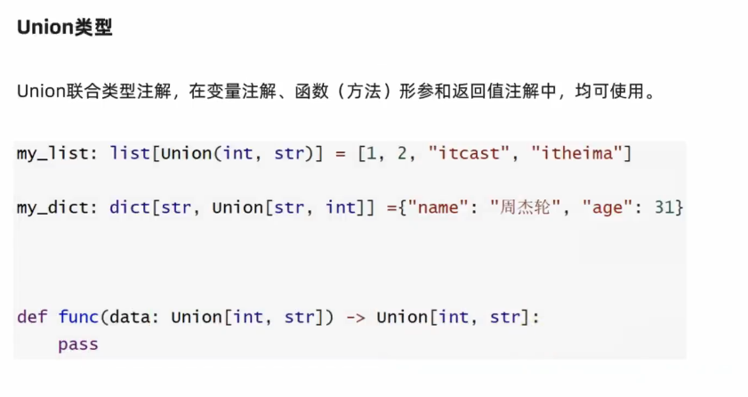

#### 多态

#### 抽象类（接口）

#### 综合案例

## SQL

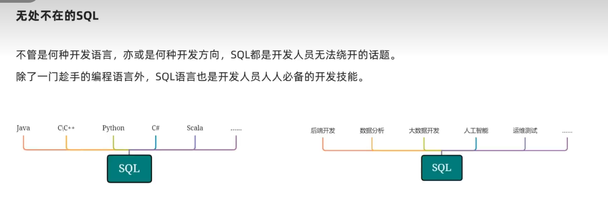

### 数据库介绍

### MySQL的安装

### MySQL的入门使用

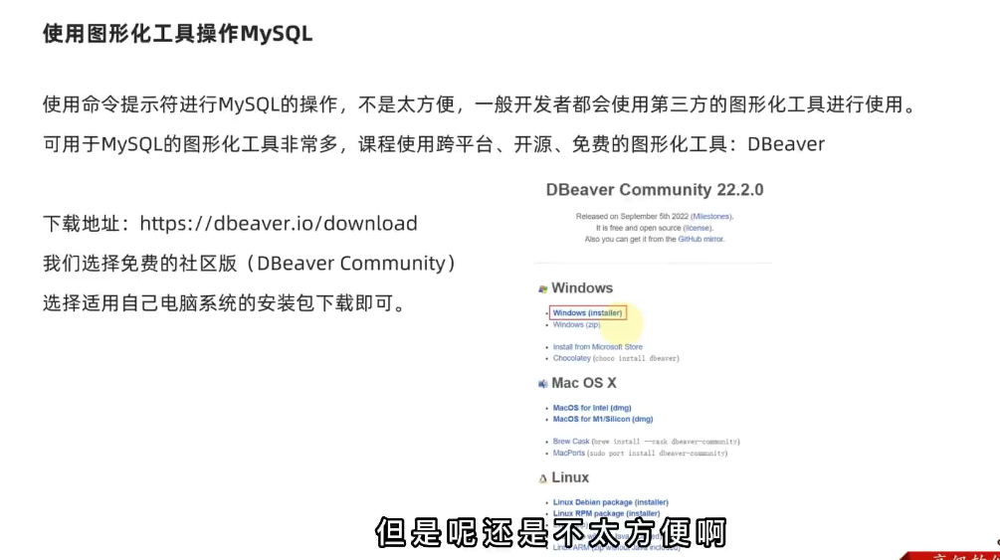

### SQL基础语言

#### SQL语言分类

##### SQL语法特征

##### DDL库管理

##### DDL表管理

##### 总结

##### DML

##### 数据插入

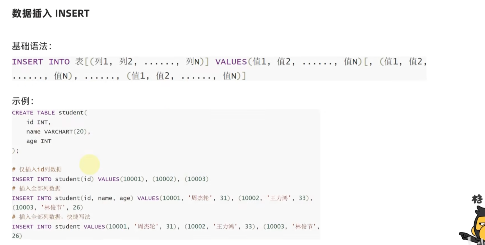

##### 数据删除

##### 数据更新

##### DQL数据查询

基础数据查询

分组聚合

对查询结果进行排序

#### Python操作MySQL

#####  创建MySQL数据库连接

##### 数据插入

##### 设置自动commit

##### SQL案例

##### 案例

### pyspark

#### 前言介绍

全部配套资源领取方式：关注黑马程序员公综号，回复关键词:领取资源02
Python+大数据学习球群284710916，告别孤单，共同进步！
软件、代码、资源下载问题
https://www.bilibili.com/read/cv7881295/

Python+大数据开发学习路线：
https://www.bilibili.com/read/cv11171369/

Linux入门：BV1n84y1i7td

https://www.bilibili.com/video/BV1n84y1i7td/?spm_id_from=333.788.video.desc.click

MySQL数据库：BV1iF411z7Pu

https://www.bilibili.com/video/BV1iF411z7Pu/?spm_id_from=333.788.video.desc.click

Hadoop入门：BV1WY4y197g7

https://www.bilibili.com/video/BV1WY4y197g7/?spm_id_from=333.788.video.desc.click

Hive数仓项目：BV1ef4y1B7KX

https://www.bilibili.com/video/BV1ef4y1B7KX/?spm_id_from=333.788.video.desc.click

PB内存计算

Python入门：BV1qW4y1a7fU

https://www.bilibili.com/video/BV1qW4y1a7fU/?spm_id_from=333.788.video.desc.click

Python编程进阶：BV1Ex411x7Xn

https://www.bilibili.com/video/BV1Ex411x7Xn/?spm_id_from=333.788.video.desc.click

spark3.2从基础到精通：BV1Jq4y1z7VP

https://www.bilibili.com/video/BV1Jq4y1z7VP/?spm_id_from=333.788.video.desc.click

Hive+Spark离线数仓工业项目实战：BV1Tv411B7Cf

https://www.bilibili.com/video/BV1Tv411B7Cf/?spm_id_from=333.788.video.desc.click

教程学习可能遇到的问题答疑（非技术型）：https://www.bilibili.com/read/cv7964085/
===============================
本课程无缝衔接数据开发、人工智能、数据分析，后续挑战30w年薪。从零基础开始入门学习Python，开发环境使用最新版python3.10，从软件下载，IDE使用，让学生一步步了解Python，掌握Python基础语法，掌握代码编写的规范和技巧，Bug调试能力，用Python第三方库做出可视化图表。课程+配套练习学练结合，锻炼学生的自主解决问题的能力和举一反三能力，课堂生动有趣，不枯燥。

#### 基础准备

##### 构建pyspark执行环境入口对象

##### spark编程模型

#### 数据输入

##### RDD对象

##### Python数据容器转RDD对象

##### 读取文件转RDD对象

#### 数据计算

###### map方法

##### flatMap方法

###### reduceByKey

KV型RDD 即 二元元组

##### 案例

##### filter方法

##### distinct方法

###### sortBy

###### 案例

#### 总结

##### collect算子

###### reduce算子

##### take算子

##### count算子

#### 数据输出

##### 输出到文件中

##### 前置条件：配置Hadoop依赖

##### saveAsTextFile算子

##### 修改RDD分区为1个

#### 综合案例

#### 分布式集群运行

### Python高阶技巧

#### 闭包

##### 闭包概念

##### 简单闭包

##### nonlocal关键字修改外部函数的变量值

#### 装饰器

#### 设计模式

###### 单例模式

##### 工厂模式

#### 多线程

##### 进程&&线程

##### 多线程编程

##### threading模块

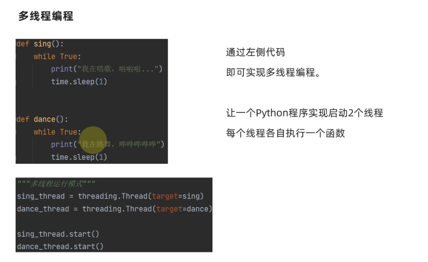

#### 网络编程

##### Socket服务端编程

##### socket客户端开发

#### 正则表达式

##### match

##### search

##### findall

##### 元字符匹配

##### 案例

#### 递归

##### 递归查找文件

