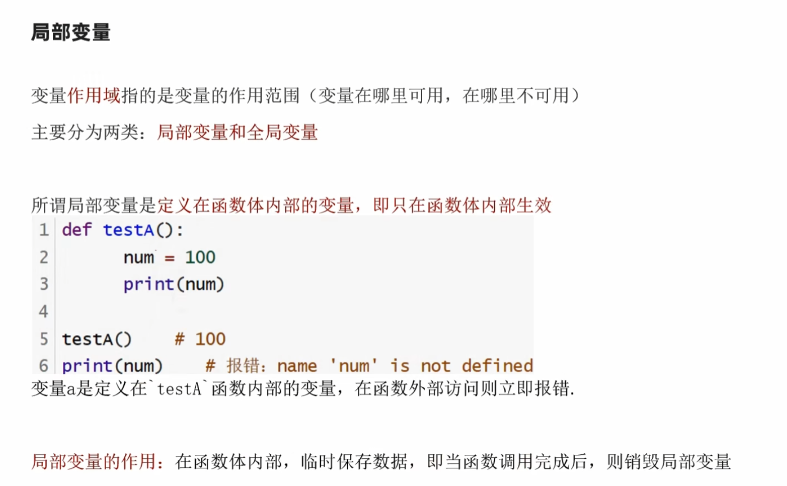
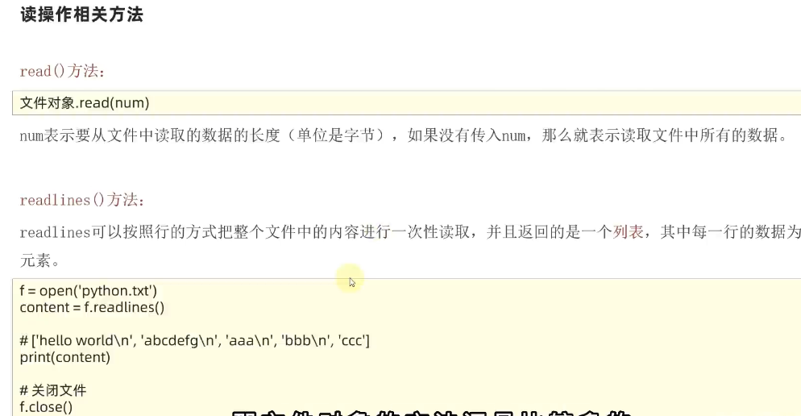
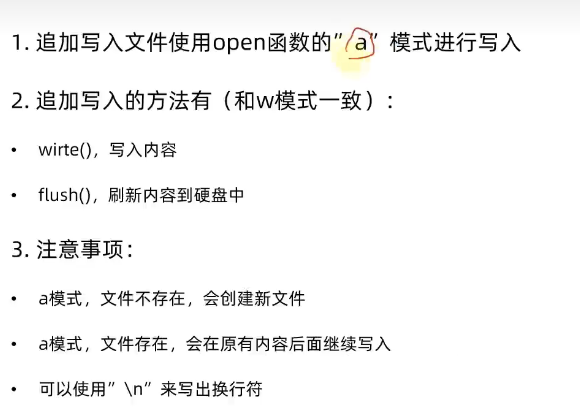

### Python中常用的6种数据类型：

### 布尔类型的定义：

### 比较运算符：

### 总结：

## 判断语句

### if判断语句

### if else 语句

### while语句

### 总结

## 循环语句

### for循环语句

### range语句

### 练习

### for循环变量作用域

### list嵌套列表的下标索引：

### list列表的常用方法：

### 查找list列表中某元素的下标：

### 修改list列表特定位置的元素值：

### list列表的插入：

### list列表的追加：

### list列表的删除、清空、统计某元素在列表中的数量：

### 统计列表内有多少元素

### 列表方法总结：

### 列表的特点：

### list列表常用功能练习：

#### list列表的遍历：

#### while循环遍历列表：

#### for循环遍历list列表：

#### 对比：

#### 案例

### 元组

#### 定义元组

#### 元组的相关操作：

####  总结

#### 案例：

### 字符串

#### 字符串的下标索引

#### 字符串的替换

#### 字符串的分割

#### 字符串的规整操作

#### 字符串的遍历：while、for

#### 字符串的特点：

#### 案例：

### 序列

#### 序列的常用操作：

#### 总结

#### 案例

### set集合

#### 集合的定义

#### 集合的修改-添加元素

#### 集合的修改-移除元素

#### 集合的修改-随机取出一个元素

#### 集合的修改-清空集合

#### 集合的修改-取两个集合的差集

#### 集合的修改-消除差集

#### 集合的修改-合并集合

#### 总结

#### 集合的特点：

#### 案例

### 字典

#### 字典的定义

#### 字典数据的获取

#### 字典的嵌套

#### 总结

#### 字典的常用操作

#### 字典常用操作的总结

#### 案例

### 数据容器对比

#### 数据容器的通用操作

#### 字符串大小比较

#### ASCII码表

### Python函数进阶

#### 函数多返回值

#### 函数多种传参

##### 位置参数

##### 关键字参数

##### 缺省参数

##### 不定长参数

##### 总结

#### 函数作为参数传递

#### 匿名函数

### Python文件操作

#### 文件编码

#### 文件操作

##### 打开文件

##### 文件读操作的相关方法

##### 案例

##### 文件写操作

##### 文件追加操作

##### 案例

